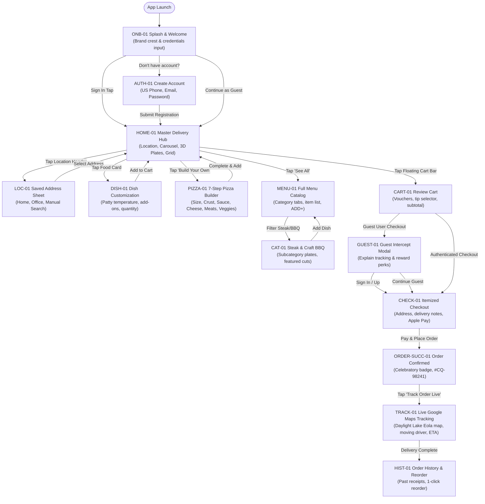
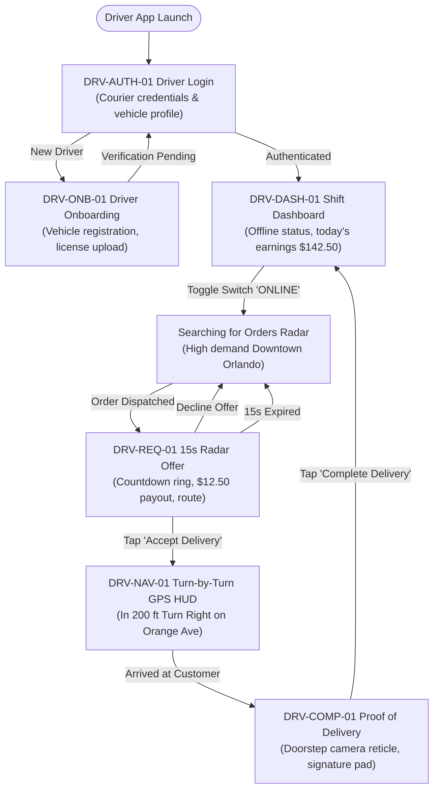

# User Flow Diagrams: Crust & Q

## 1. Customer Discovery, Customization & Ordering Journey

```mermaid
flowchart TD
    Launch([App Launch]) --> ONB01["ONB-01 Splash & Welcome\n(Brand crest & credentials input)"]
    ONB01 -->|Sign In Tap| HOME01["HOME-01 Master Delivery Hub\n(Location, Carousel, 3D Plates, Grid)"]
    ONB01 -->|Don't have account?| AUTH01["AUTH-01 Create Account\n(US Phone, Email, Password)"]
    AUTH01 -->|Submit Registration| HOME01
    ONB01 -->|Continue as Guest| HOME01
    
    HOME01 -->|Tap Location Header| LOC01["LOC-01 Saved Address Sheet\n(Home, Office, Manual Search)"]
    LOC01 -->|Select Address| HOME01

    HOME01 -->|Tap Food Card| DISH01["DISH-01 Dish Customization\n(Patty temperature, add-ons, quantity)"]
    DISH01 -->|Add to Cart| HOME01

    HOME01 -->|Tap 'Build Your Own'| PIZZA01["PIZZA-01 7-Step Pizza Builder\n(Size, Crust, Sauce, Cheese, Meats, Veggies)"]
    PIZZA01 -->|Complete & Add| HOME01

    HOME01 -->|Tap 'See All'| MENU01["MENU-01 Full Menu Catalog\n(Category tabs, item list, ADD+)"]
    MENU01 -->|Filter Steak/BBQ| CAT01["CAT-01 Steak & Craft BBQ\n(Subcategory plates, featured cuts)"]
    CAT01 -->|Add Dish| MENU01

    HOME01 -->|Tap Floating Cart Bar| CART01["CART-01 Review Cart\n(Vouchers, tip selector, subtotal)"]
    CART01 -->|Guest User Checkout| GUEST01["GUEST-01 Guest Intercept Modal\n(Explain tracking & reward perks)"]
    GUEST01 -->|Sign In / Up| CHECK01["CHECK-01 Itemized Checkout\n(Address, delivery notes, Apple Pay)"]
    GUEST01 -->|Continue Guest| CHECK01
    CART01 -->|Authenticated Checkout| CHECK01

    CHECK01 -->|Pay & Place Order| ORDERSUCC["ORDER-SUCC-01 Order Confirmed\n(Celebratory badge, #CQ-98241)"]
    ORDERSUCC -->|Tap 'Track Order Live'| TRACK01["TRACK-01 Live Google Maps Tracking\n(Daylight Lake Eola map, moving driver, ETA)"]
    TRACK01 -->|Delivery Complete| HIST01["HIST-01 Order History & Reorder\n(Past receipts, 1-click reorder)"]
```

---

## 2. Delivery Partner Operational Shift Journey

```mermaid
flowchart TD
    DrvLaunch([Driver App Launch]) --> DRVAUTH01["DRV-AUTH-01 Driver Login\n(Courier credentials & vehicle profile)"]
    DRVAUTH01 -->|New Driver| DRVONB01["DRV-ONB-01 Driver Onboarding\n(Vehicle registration, license upload)"]
    DRVONB01 -->|Verification Pending| DRVAUTH01
    DRVAUTH01 -->|Authenticated| DRVDASH01["DRV-DASH-01 Shift Dashboard\n(Offline status, today's earnings $142.50)"]
    
    DRVDASH01 -->|Toggle Switch 'ONLINE'| SearchingState["Searching for Orders Radar\n(High demand Downtown Orlando)"]
    SearchingState -->|Order Dispatched| DRVREQ01["DRV-REQ-01 15s Radar Offer\n(Countdown ring, $12.50 payout, route)"]
    
    DRVREQ01 -->|Decline Offer| SearchingState
    DRVREQ01 -->|15s Expired| SearchingState
    DRVREQ01 -->|Tap 'Accept Delivery'| DRVNAV01["DRV-NAV-01 Turn-by-Turn GPS HUD\n(In 200 ft Turn Right on Orange Ave)"]
    
    DRVNAV01 -->|Arrived at Customer| DRVCOMP01["DRV-COMP-01 Proof of Delivery\n(Doorstep camera reticle, signature pad)"]
    DRVCOMP01 -->|Tap 'Complete Delivery'| DRVDASH01
```
